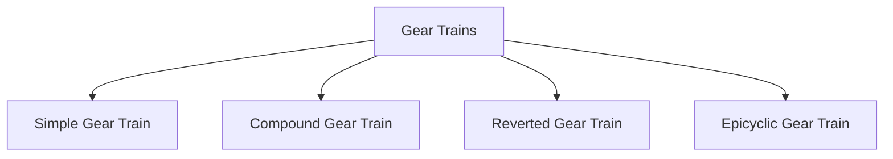
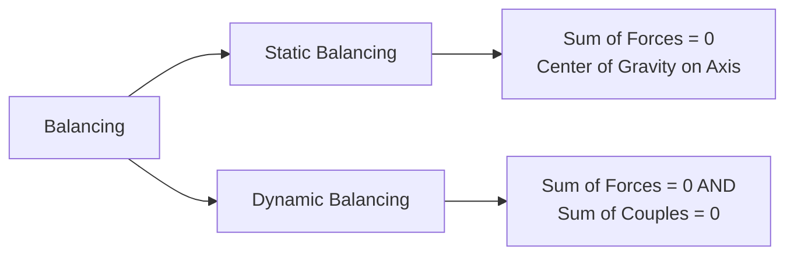

# 📘 Dynamics of Machinery (DOM) - Master Viva Guide

> [!IMPORTANT]  
> **Golden Viva Rule:** Professors want to see if you understand the *physical meaning* and *real-world applications* of concepts. Mathematical derivations are rarely asked.

## ⚙️ SECTION 1: Gear Trains & Gearboxes

### Classification

### Real-World Applications
| Gear Train Type | Real-World Application | Why is it used? |
| :--- | :--- | :--- |
| **Reverted** | Clocks, Speed Reducers, Lathes | The input and output shafts are co-axial (in the same line). |
| **Epicyclic** | Automatic Transmissions, Differentials | Provides very high velocity ratios in a compact space. |

> [!TIP]
> **Synchromesh vs. Constant Mesh:** In constant mesh, gears are always engaged, and dog clutches slide to connect them (can grind). In synchromesh, friction cones equalize the speed *before* the dog clutch engages, preventing grinding during gear shifts.

---

## 🔄 SECTION 2: Flywheels vs. Governors

> [!CAUTION]  
> Do not confuse these two! This is the most commonly asked trick question in a DOM viva.

| Feature | Flywheel | Governor |
| :--- | :--- | :--- |
| **Primary Function** | Controls speed variations within a **single cycle**. | Controls mean speed over a **period of time**. |
| **Cause of Variation** | Internal (Fluctuation of engine turning moment). | External (Changes in the load on the engine). |
| **Mechanism** | Acts as an energy reservoir (stores/releases energy). | Regulates the quantity of fuel supplied to the engine. |

**Real-World Application:** Punching machines use flywheels so a smaller motor can be used. The flywheel stores energy during the idle period and releases a massive burst of energy during the fraction of a second when the punch hits the metal.

---

## 🧭 SECTION 3: Gyroscope

> [!NOTE]  
> **The Core Formula:** Gyroscopic Couple $C = I \cdot \omega \cdot \omega_p$  
> ($I$ = Mass moment of inertia, $\omega$ = Spin velocity, $\omega_p$ = Precession velocity)

### Effect on Ships (High-Yield)
When a ship moves in the sea, the gyroscopic effect of its massive spinning rotor (turbine) affects its stability.

| Ship Motion | Gyroscopic Effect? | Consequence |
| :--- | :--- | :--- |
| **Pitching** (Bow up/down) | **MAXIMUM** | The ship tends to turn towards Port or Starboard. |
| **Rolling** (Side to side) | **ZERO** | The axis of spin is parallel to the axis of roll. |
| **Steering** (Turning) | Yes | The bow tends to raise or dip. |

---

## ⚖️ SECTION 4: Balancing

### Types of Balancing

### Primary vs. Secondary Balancing (Engines)
*   **Primary Force:** Runs at engine speed ($N$). It is the main unbalance force.
*   **Secondary Force:** Runs at twice the engine speed ($2N$). It is caused by the *obliquity* (angle) of the connecting rod. It is much smaller than the primary force.

> [!TIP]
> **Direct and Reverse Cranks:** A theoretical mathematical method to balance multi-cylinder engines by imagining the reciprocating mass as two separate rotating masses going in opposite directions.

---

## 📉 SECTION 5: Vibrations

### Types of Damping ($\zeta$)
The Damping Ratio ($\zeta$) defines how a system returns to equilibrium.

| $\zeta$ Value | Type | Behavior | Real-World Application |
| :--- | :--- | :--- | :--- |
| **$\zeta < 1$** | **Underdamped** | Oscillates with decreasing amplitude. | Car suspensions (bouncing after a bump). |
| **$\zeta = 1$** | **Critically Damped** | Returns to rest in the *fastest* time without oscillating. | **Gun recoil mechanisms**, Door closers. |
| **$\zeta > 1$** | **Overdamped** | Sluggishly returns to rest without oscillating. | Heavy industrial blast doors. |

### Key Definitions
*   **Resonance:** When the external excitation frequency exactly matches the natural frequency, causing violently large amplitudes (like the Tacoma Narrows Bridge collapse).
*   **Logarithmic Decrement:** A measure of how fast free vibrations decay in an underdamped system.
*   **Transmissibility:** The ratio of force transmitted to the floor vs. force generated by the machine. We use rubber mounts (isolators) to keep this ratio $< 1$.
*   **Whirling (Critical) Speed:** The rotational speed where a shaft becomes unstable and bows outward violently because it hits its natural frequency of transverse vibration.
