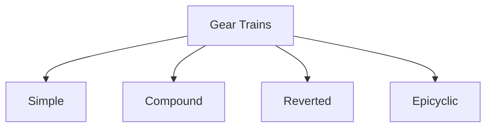

# 📘 Dynamics of Machinery (DOM) - Master Viva Guide

> [!IMPORTANT]  
> **Golden Viva Rule:** Professors want to see if you understand the *physical meaning* and *real-world applications* of concepts. Mathematical derivations are rarely asked.

## ⚙️ SECTION 1: Gear Trains, Gearboxes, Flywheels & Gyroscopes

### 1. Gear Trains & Gearboxes
**Classification**

*   **Velocity Ratio (VR):** Speed of the driver / Speed of the driven.
*   **Holding Torque:** In an epicyclic gear train, it's the torque required to hold the fixed gear stationary.
*   **Tabular Method:** A standard mathematical method used to find the speed of various gears in an *epicyclic* gear train by assuming one gear is fixed and giving +1 revolution to the arm.
*   **PIV Drive (Positively Infinitely Variable):** A gearbox mechanism that provides a continuously variable speed ratio (stepless speed variation) using a specialized chain and conical grooved wheels.

**Real-World Applications**
| Gear Train Type | Real-World Application | Why is it used? |
| :--- | :--- | :--- |
| **Reverted** | Clocks, Speed Reducers | Input and output shafts are co-axial. |
| **Epicyclic** | Differentials, Auto Transmissions | High velocity ratios in a compact space. |

> [!TIP]
> **Synchromesh vs. Constant Mesh:** In constant mesh, gears are always engaged, and dog clutches slide to connect them (can grind). In synchromesh, friction cones equalize the speed *before* the dog clutch engages.

### 2. Flywheels
> [!CAUTION]  
> Do not confuse Flywheels with Governors!

| Feature | Flywheel | Governor |
| :--- | :--- | :--- |
| **Primary Function** | Controls speed variations within a **single cycle**. | Controls mean speed over a **period of time**. |
| **Cause of Variation** | Internal (Fluctuation of turning moment). | External (Changes in the load). |
| **Mechanism** | Acts as an energy reservoir (stores/releases). | Regulates the quantity of fuel supplied. |

*   **Turning Moment Diagram:** A graphical representation of the turning moment (torque) against the crank angle for various strokes of the engine. The area under the curve gives the work done.
*   **Coefficient of Fluctuation of Energy ($C_e$):** Ratio of maximum fluctuation of energy to the work done per cycle.
*   **Punching Machine Application:** The flywheel stores energy during the idle period and releases it during the fraction of a second when the punch hits, allowing the use of a smaller motor.

### 3. Gyroscope
> [!NOTE]  
> **Gyroscopic Couple Formula:** $C = I \cdot \omega \cdot \omega_p$ ($I$=Inertia, $\omega$=Spin, $\omega_p$=Precession)

*   **Effect on Ships:**
    *   **Pitching (Bow up/down):** MAXIMUM gyroscopic effect. Ship turns Port/Starboard.
    *   **Rolling (Side to side):** ZERO gyroscopic effect (spin axis is parallel to roll axis).
*   **Effect on Aeroplanes:** If a propeller rotates clockwise (viewed from rear), taking a left turn causes the **nose to raise and tail to dip** due to the reactive gyroscopic couple.
*   **Effect on 2-Wheelers:** Gyroscopic effect helps stabilize the vehicle. When turning, leaning inwards counteracts the overturning gyroscopic couple.

---

## ⚖️ SECTION 2: Balancing and Vibrations

### 1. Balancing
*   **Static Balancing:** The center of gravity lies on the axis of rotation ($\Sigma Forces = 0$).
*   **Dynamic Balancing:** The rotor doesn't wobble. ($\Sigma Forces = 0$ AND $\Sigma Couples = 0$).
*   **Rotating vs Reciprocating Masses:** Rotating masses can be completely balanced. Reciprocating masses (pistons) can only be *partially* balanced because complete balancing would introduce an unbalanced force perpendicular to the line of stroke.
*   **Primary vs. Secondary Force:** Primary runs at engine speed ($N$). Secondary is caused by the *obliquity* of the connecting rod and runs at twice the engine speed ($2N$).
*   **Direct and Reverse Cranks:** A theoretical method to analyze unbalanced forces in multi-cylinder engines by treating reciprocating mass as two separate rotating masses going in opposite directions.

### 2. Vibrations (Free & Forced)
*   **Degree of Freedom (DOF):** Minimum independent coordinates needed to define the system's position.
*   **Natural Frequency:** Frequency of oscillation without external forces or damping.
*   **Energy Method:** A method to find natural frequency by assuming total energy (Kinetic + Potential) is constant ($dE/dt = 0$).
*   **Phase Plane Representation:** A graphical way to study vibrations by plotting velocity vs. displacement.

**Types of Damping ($\zeta$)**
| $\zeta$ Value | Type | Behavior | Real-World Application |
| :--- | :--- | :--- | :--- |
| **$\zeta < 1$** | **Underdamped** | Oscillates & decays. | Car suspensions. |
| **$\zeta = 1$** | **Critically Damped** | Fastest return, no oscillation. | Gun recoil, door closers. |
| **$\zeta > 1$** | **Overdamped** | Sluggish return. | Heavy blast doors. |
| **-** | **Coulomb Damping** | Dry friction damping | Sliding surfaces, brake pads. |

*   **Logarithmic Decrement:** A measure of how fast free vibrations decay in an underdamped system.
*   **Resonance:** When external excitation frequency = natural frequency. Causes dangerously large amplitudes.
*   **Phase Lag:** The angle by which the response of the system lags behind the applied harmonic force.
*   **Transmissibility:** Ratio of force transmitted to the foundation vs. force applied. Use isolators to keep $< 1$.
*   **Whirling (Critical) Speed:** Speed where a shaft becomes dynamically unstable and bows outward, matching its natural frequency of transverse vibration.
